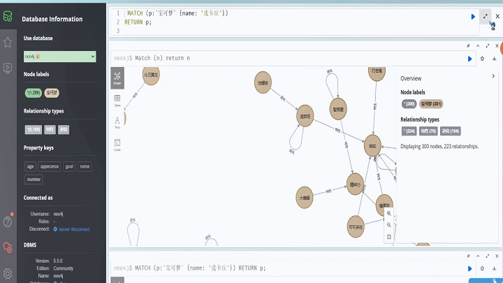

# 知识图谱 & 问答 :punch:

这个项目涉及到知识图谱构建和宝可梦问答系统的开发。

## 目录路径 :raised_hands:

```plaintext
─ KG
│   data.csv
│   graph.png
│   特征kg.txt
│   进化kg.txt
│
└─KGQA
        pk_qa.py
        qa.py
            
```

- ## 文件名称 :walking:

  - `特征kg.txt` :file_folder:：从 `data.csv` 中抽取的特征知识图谱实体。
  - `进化kg.txt` :file_folder:：从 `data.csv` 中抽取的进化知识图谱实体。
  - `build_graph_pk.py` :file_folder:：用于使用 Neo4j 数据库构建知识图谱的脚本。
  - `pk_qa.py` :file_folder:：宝可梦问答接口的实现脚本。
  - `qa.py` :file_folder:：实现多轮对话的脚本。

## 图谱概览


### 使用neo4j 查询实体 "皮卡丘":heart_eyes:





## 宝可梦Q&A问答 


## 优化 :rocket:

这个项目包括构建知识图谱和宝可梦问答系统。你可以进一步优化项目，包括：

- 扩展知识图谱以包括更多实体和关系。
- 提高问答系统的准确性和交互性。
- 添加更多功能，如多语言支持或实时查询。
- 定期维护和更新知识图谱 。
