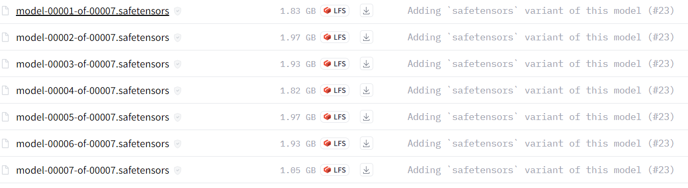

# ChatGLM3-6B 多轮对话微调宝可梦数据集 🚀

这个项目是基于 [ChatGLM3](https://github.com/THUDM/ChatGLM3) 的扩展，专注于利用宝可梦数据集对聊天模型进行微调。我们使用 RTX 4090 24G 进行训练，确保高效的模型性能

### 环境安装 🛠️

首先需要下载ChatGLM3-6B 官方仓库：

```
git clone https://github.com/THUDM/ChatGLM3
cd ChatGLM3
```

然后使用 pip 安装依赖：

```
pip install -r requirements.txt
```


**替换 `finetune_chatmodel_demo` 文件夹**: 将官方的 `finetune_chatmodel_demo` 文件夹替换为本项目提供的版本。

运行示例需要 `python>=3.10`，除基础的 `torch` 依赖外，示例代码运行还需要依赖

```
pip install requirements.txt
```


 进入THUDM文件夹，[huggingface](https://huggingface.co/THUDM/chatglm3-6b?clone=true)  下载  

```

初始化git lfs：
curl -s https://packagecloud.io/install/repositories/github/git-lfs/script.deb.sh | sudo bash
sudo apt-get install git-lfs
git lfs install
git clone https://huggingface.co/THUDM/chatglm3-6b
```

注: 有的LFS无法通过git clone下载，需要使用wget  文件链接下载。





## 多轮对话格式

多轮对话微调示例采用 ChatGLM3 对话格式约定，对不同角色添加不同 `loss_mask` 从而在一遍计算中为多轮回复计算 `loss`。

## 数据格式和预处理 📊

我们的数据格式遵循 ChatGLM3 对话格式约定。请参照以下格式整理您的对话数据：

```
jsonCopy code[
  {
    "conversations": [
      {"role": "system", "content": "<system prompt text>"},
      {"role": "user", "content": "<user prompt text>"},
      {"role": "assistant", "content": "<assistant response text>"},
      // ... 多轮对话
    ]
  },
  // ...
]
```

**参考我文件夹data_processing中的脚本，具体而言对于data.csv（ 数据可视化数据集或者爬虫清洗过的数据）执行 data_processing.py（根据自己数据修改）得到json文件， 然后执行format_tool_poke.py  得到 jsonl文件**。

## 微调模型 💡

以下脚本提供了微调模型的参考方式。

```
./scripts/finetune_ds_multiturn.sh  # 全量微调
./scripts/finetune_pt_multiturn.sh  # P-Tuning v2 微调
```

我这里采用 P-Tuning v2 微调。（ 参考我写的  finetune_ps_pt_m.sh）

官方说法：

参考显存用量

- P-Tuning V2 `PRE_SEQ_LEN=128`, `DEV_BATCH_SIZE=1`, `GRAD_ACCUMULARION_STEPS=16`, `MAX_SEQ_LEN=2048` 配置下约需要 21GB 显存。
- 全量微调时，`./scripts/finetune_ds_multiturn.sh` 中的配置（`MAX_SEQ_LEN=2048`, `DEV_BATCH_SIZE=16`, `GRAD_ACCUMULARION_STEPS=1`）恰好用满 4 * 80GB 显存。

### 推理验证 :anguished:

使用以下命令进行推理验证：

```
  python inference.py     --pt-checkpoint /path/to/your/model     --model THUDM/chatglm3-6b     --tokenizer THUDM/chatglm3-6b     --pt-pre-seq-len 128     --max-new-tokens 128 \
```

-  /path/to/your/model : 指的是你训练结束的模型路径,比如  /root/autodl-tmp/project/finetune_chatmodel_demo/output/pokemon

- finetune_chatmodel_demo 文件夹下inference.py  


### 推理演示  :sunflower:


###  推理GPU使用率 :mushroom:


## 总结 ✨

我们的项目旨在提供一个详细的训练调试自己数据集的方法， 在 ChatGLM3 框架下对宝可梦数据集进行微调。我们提供了详细的安装指导、数据处理步骤和微调示例，以帮助您快速上手和运行模型。🚀