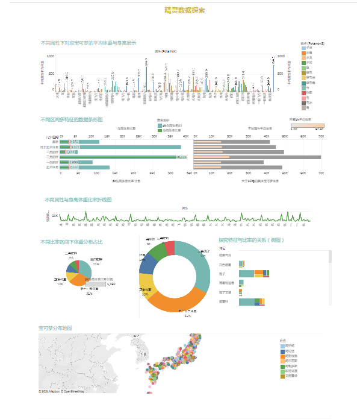
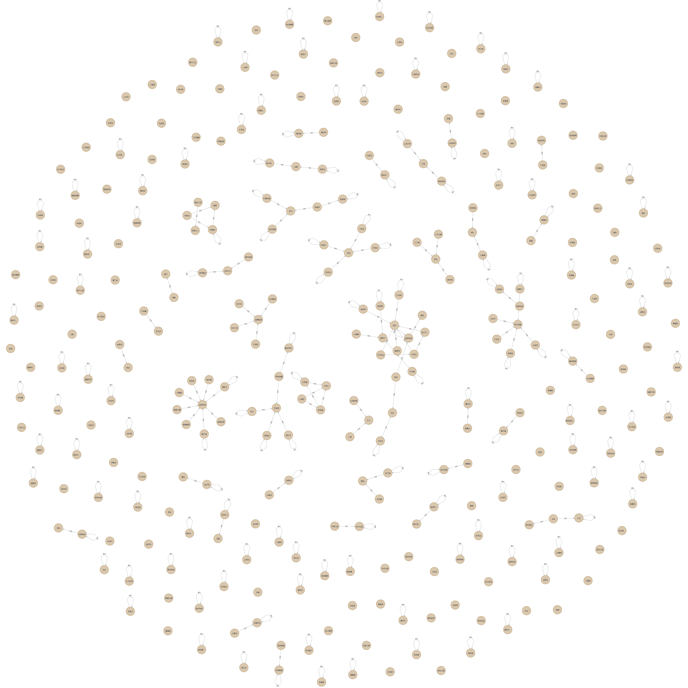
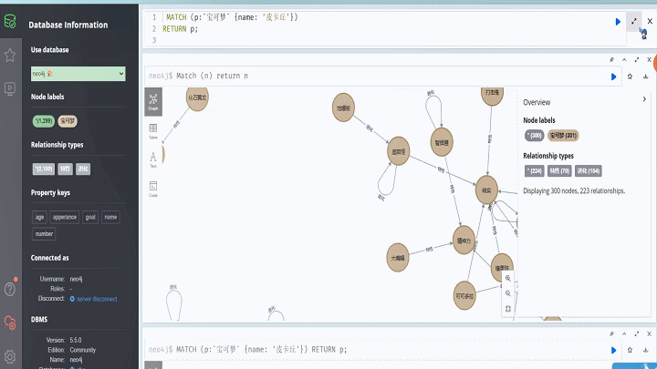
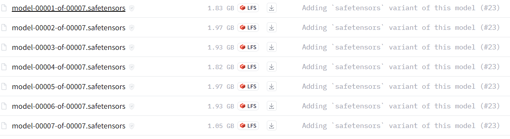
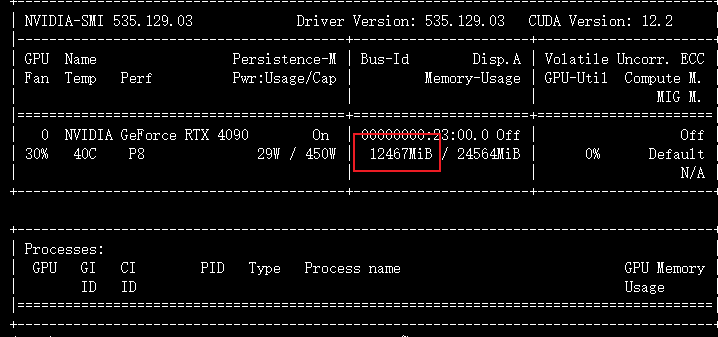

# Curriculum
## django网址部署到阿里云上 :http://47.101.195.146/
## 课程设计总概

该项目以网络爬虫进行数据采集，利用pandas和numpy对数据进行清洗。随后，使用Tableau仪表盘对清洗后的数据进行可视化呈现。对从数据中提取的信息，进行知识图谱的构建，并实现QA问答系统。接下来，基于数据属性，对宝可梦多轮对话大模型进行微调。最终阶段，项目利用宝可梦的图片进行CLIP跨模态探索，进一步优化模型性能。这整个过程融合了数据采集、清洗、可视化、知识图谱构建、QA系统、模型微调和跨模态探索，形成一个全面而多层次的数据科学项目。

## 精灵宝可梦爬虫 :video_game:

这是一个精灵宝可梦爬虫项目，用于获取有关精灵宝可梦的信息和图片。

### 爬取的网页 :laughing:

- [精灵宝可梦官方网站](https://tw.portal-pokemon.com/play/pokedex/0001)

### 项目文件 :file_folder:

- `pokemon.py` :file_folder:：源代码文件，用于执行爬虫操作。
- `imgs` :heart_eyes: :file_folder:：存储爬取的精灵宝可梦图片，命名格式为 "序号+姓名+文件名"，例如：`0001妙蛙種子.png`。

### 数据文件 :bar_chart:

- `pokemon.csv` :joy: :file_folder:：由 `pokemon.py` 生成的原始数据文件。
- `pokemon_excel.csv` :file_folder:：使用 Excel 对 `pokemon.csv` 进行初步筛选和处理的数据文件。

### 优化 :rocket:

这个项目的目标是收集精灵宝可梦的信息和图片。你可以进一步优化项目，包括：

- 添加数据清洗和特征工程步骤，以提高数据质量。
- 创建数据可视化以分析和展示有趣的信息。
- 自动化爬虫，以定期获取最新的精灵宝可梦数据。
- 为数据文件添加详细的文档和注释，使其他人可以理解和使用数据。

欢迎随时扩展和改进这个项目，以满足你的需求和兴趣。祝你在这个精灵宝可梦爬虫项目中取得成功！ :tada:


## 数据清洗和特征工程 :muscle:

### 目录结构 :file_folder:

#### Data_cleaning

- `data_processing.csv` :file_folder:：经过数据处理的文件
- `pokemon_excel.csv` :file_folder:：从爬虫获取的文件
- `清洗.ipynb` :file_folder:：数据清洗的Jupyter Notebook文件

#### Data Visualization

- `data+` (多个连接).hyper :file_folder:：包含多个数据连接的Hyper文件
- `data.csv` :file_folder:：与 `data_processing.csv` 相同的数据文件
- `data.xlsx` :file_folder:：与 `data_processing.csv` 相同的数据文件（Excel格式）
- `体重超过10kg.xlsx` :file_folder:：包含体重超过10kg的数据（Excel格式）
- `属性和弱点分析.xls` :file_folder:：包含属性和弱点分析的数据（Excel格式）
- `平均身高.xlsx` :file_folder:：包含平均身高数据（Excel格式）
- `查询.sql` :file_folder:：包含SQL查询的文件
- `特定弱点火的角色详细信息.xlsx` :file_folder:：包含特定弱点火属性的角色详细信息（Excel格式）
- `画图.twb` :file_folder:：使用 Tableau 进行数据可视化的文件
- `身高体重比率.xlsx` :file_folder:：包含身高体重比率数据（Excel格式）

### 文件详解 :runner:

- `pokemon_excel.csv` :two_hearts:：这是从爬虫获取的数据文件。
- `data_processing.csv` :v:：这是经过使用 NumPy 和 Pandas 进行基本数据处理的文件。
- `data.csv` / `data.xlsx` :v:：这两个文件包含相同的数据，分别以 CSV 和 Excel 格式提供。
- `查询.sql` :person_with_pouting_face:: 这是包含 SQL 查询的文件，用于数据分析。
- `画图.twb` :smile:: 这个文件包含了使用 Tableau 进行的数据可视化，你可以在 [Tableau 数据可视化](https://public.tableau.com/app/profile/luhuanz.lu/viz/Coursedesigndatavisualization/1) 上查看。



  

## 知识图谱 & 问答 :punch:

这个项目涉及到知识图谱构建和宝可梦问答系统的开发。

### 目录路径 :raised_hands:

```plaintext
─ KG
│   data.csv
│   graph.png
│   特征kg.txt
│   进化kg.txt
│
└─KGQA
        pk_qa.py
        qa.py
            
```

- ### 文件名称 :walking:

  - `特征kg.txt` :file_folder:：从 `data.csv` 中抽取的特征知识图谱实体。
  - `进化kg.txt` :file_folder:：从 `data.csv` 中抽取的进化知识图谱实体。
  - `build_graph_pk.py` :file_folder:：用于使用 Neo4j 数据库构建知识图谱的脚本。
  - `pk_qa.py` :file_folder:：宝可梦问答接口的实现脚本。
  - `qa.py` :file_folder:：实现多轮对话的脚本。

### 图谱概览




#### 使用neo4j 查询实体 "皮卡丘":heart_eyes:





### 宝可梦Q&A问答 


### 优化 :rocket:

这个项目包括构建知识图谱和宝可梦问答系统。你可以进一步优化项目，包括：

- 扩展知识图谱以包括更多实体和关系。
- 提高问答系统的准确性和交互性。
- 添加更多功能，如多语言支持或实时查询。
- 定期维护和更新知识图谱 。


## ChatGLM3-6B 多轮对话微调宝可梦数据集 🚀

这个项目是基于 [ChatGLM3](https://github.com/THUDM/ChatGLM3) 的扩展，专注于利用宝可梦数据集对聊天模型进行微调。我们使用 RTX 4090 24G 进行训练，确保高效的模型性能

### 环境安装 🛠️

首先需要下载ChatGLM3-6B 官方仓库：

```git
git clone https://github.com/THUDM/ChatGLM3
cd ChatGLM3
```

然后使用 pip 安装依赖：

```python
pip install -r requirements.txt
```


**替换 `finetune_chatmodel_demo` 文件夹**: 将官方的 `finetune_chatmodel_demo` 文件夹替换为本项目提供的版本。

运行示例需要 `python>=3.10`，除基础的 `torch` 依赖外，示例代码运行还需要依赖

```python
pip install requirements.txt
```


 进入THUDM文件夹，[huggingface](https://huggingface.co/THUDM/chatglm3-6b?clone=true)  下载  

```bash
初始化git lfs：
curl -s https://packagecloud.io/install/repositories/github/git-lfs/script.deb.sh | sudo bash
sudo apt-get install git-lfs
git lfs install
git clone https://huggingface.co/THUDM/chatglm3-6b
```

注: 有的LFS无法通过git clone下载，需要使用wget  文件链接下载。





### 多轮对话格式

多轮对话微调示例采用 ChatGLM3 对话格式约定，对不同角色添加不同 `loss_mask` 从而在一遍计算中为多轮回复计算 `loss`。

### 数据格式和预处理 📊

我们的数据格式遵循 ChatGLM3 对话格式约定。请参照以下格式整理您的对话数据：

```json
jsonCopy code[
  {
    "conversations": [
      {"role": "system", "content": "<system prompt text>"},
      {"role": "user", "content": "<user prompt text>"},
      {"role": "assistant", "content": "<assistant response text>"},
      // ... 多轮对话
    ]
  },
  // ...
]
```

**参考我文件夹data_processing中的脚本，具体而言对于data.csv（ 数据可视化数据集或者爬虫清洗过的数据）执行 data_processing.py（根据自己数据修改）得到json文件， 然后执行format_tool_poke.py  得到 jsonl文件**。

### 微调模型 💡

以下脚本提供了微调模型的参考方式。

```bash
./scripts/finetune_ds_multiturn.sh  # 全量微调
./scripts/finetune_pt_multiturn.sh  # P-Tuning v2 微调
```

我这里采用 P-Tuning v2 微调。（ 参考我写的  finetune_ps_pt_m.sh）

官方说法：

参考显存用量

- P-Tuning V2 `PRE_SEQ_LEN=128`, `DEV_BATCH_SIZE=1`, `GRAD_ACCUMULARION_STEPS=16`, `MAX_SEQ_LEN=2048` 配置下约需要 21GB 显存。
- 全量微调时，`./scripts/finetune_ds_multiturn.sh` 中的配置（`MAX_SEQ_LEN=2048`, `DEV_BATCH_SIZE=16`, `GRAD_ACCUMULARION_STEPS=1`）恰好用满 4 * 80GB 显存。

### 推理验证 :anguished:

使用以下命令进行推理验证：

```python
  python inference.py     --pt-checkpoint /path/to/your/model     --model THUDM/chatglm3-6b     --tokenizer THUDM/chatglm3-6b     --pt-pre-seq-len 128     --max-new-tokens 128 \
```

-  /path/to/your/model : 指的是你训练结束的模型路径,比如  /root/autodl-tmp/project/finetune_chatmodel_demo/output/pokemon

-  finetune_chatmodel_demo 文件夹下inference.py  


### 推理演示  :sunflower:


###  推理GPU使用率 :mushroom:



### 总结 ✨

我们的项目旨在提供一个详细的训练调试自己数据集的方法， 在 ChatGLM3 框架下对宝可梦数据集进行微调。我们提供了详细的安装指导、数据处理步骤和微调示例，以帮助您快速上手和运行模型。🚀


## CLIP宝可梦图像探索

🐉 使用CLIP模型探索宝可梦的世界！本项目通过图片与对应的中文名字，使用多模态学习方法来识别和分析宝可梦图片。项目基于Chinese-CLIP模型，专为处理中文文本而优化。我们通过图片与图片名进行多模态探索。

例如 imgs： 0001妙蛙种子.png

考虑到clip对于中文支持不那么优秀。本项目基于 [Chinese-CLIP ](https://github.com/OFA-Sys/Chinese-CLIP)。  

Chinese-CLIP 是CLIP模型的**中文**版本，使用大规模中文数据进行训练（~2亿图文对），旨在帮助用户快速实现中文领域的[图文特征&相似度计算](https://github.com/OFA-Sys/Chinese-CLIP#API快速上手)、[跨模态检索](https://github.com/OFA-Sys/Chinese-CLIP#跨模态检索)、[零样本图片分类](https://github.com/OFA-Sys/Chinese-CLIP#零样本图像分类)等任务。(参考Chinese-Clip readme)


### 安装要求 🛠

开始本项目前，需先检查是否满足下列环境配置要求:

- python >= 3.6.4
- pytorch >= 1.8.0 (with torchvision >= 0.9.0)
- CUDA Version >= 10.2

运行下列命令即可安装本项目所需的三方库。

```python
pip install -r requirements.txt
```

### 快速开始 🚀

安装Chinese-CLIP后，您可以轻松地调用API，进行图文特征提取和相似度计算。首先，安装cn_clip：

```bash
# 通过pip安装
pip install cn_clip

# 或者从源代码安装
cd Chinese-CLIP
pip install -e .
```

安装成功后，即可通过如下方式轻松调用API，传入指定图片（[示例](https://github.com/OFA-Sys/Chinese-CLIP/blob/master/examples/pokemon.jpeg)）和文本，提取图文特征向量并计算相似度：

```python
import torch 
from PIL import Image

import cn_clip.clip as clip
from cn_clip.clip import load_from_name, available_models
print("Available models:", available_models())  
# Available models: ['ViT-B-16', 'ViT-L-14', 'ViT-L-14-336', 'ViT-H-14', 'RN50']

device = "cuda" if torch.cuda.is_available() else "cpu"
model, preprocess = load_from_name("ViT-B-16", device=device, download_root='./')
model.eval()
image = preprocess(Image.open("examples/pokemon.jpeg")).unsqueeze(0).to(device)
text = clip.tokenize(["杰尼龟", "妙蛙种子", "小火龙", "皮卡丘"]).to(device)

with torch.no_grad():
    image_features = model.encode_image(image)
    text_features = model.encode_text(text)
    # 对特征进行归一化，请使用归一化后的图文特征用于下游任务
    image_features /= image_features.norm(dim=-1, keepdim=True) 
    text_features /= text_features.norm(dim=-1, keepdim=True)    

    logits_per_image, logits_per_text = model.get_similarity(image, text)
    probs = logits_per_image.softmax(dim=-1).cpu().numpy()

print("Label probs:", probs)  # [[1.268734e-03 5.436878e-02 6.795761e-04 9.436829e-01]]
```

注意这里的pokemon.jpeg 是Chinese-clip目录中的。

### 训练您自己的数据集 🌟

本项目支持使用您自己的数据集进行模型训练。请遵循以下步骤来组织您的代码和数据：

### 代码组织

下载本项目后, 请创建新的文件夹 `${DATAPATH}` 以存放数据集、预训练ckpt、以及finetune产生的模型日志&ckpt。推荐工作区目录结构如下：

```plaintext
Chinese-CLIP/
├── run_scripts/
│   ├── muge_finetune_vit-b-16_rbt-base.sh   #官方是多卡，我这里修改为单卡
│   ├── flickr30k_finetune_vit-b-16_rbt-base.sh
│   └── ...           # 更多finetune或评测脚本...
└── cn_clip/
    ├── clip/
    ├── eval/
    ├── preprocess/
    └── training/

${DATAPATH}  #这里我放在 Chinese-CLIP/
├── pretrained_weights/
├── experiments/   #改为  ${DATAPATH}/logs/ 就是 Chinese-CLIP/logs
├── deploy/	      # 用于存放ONNX & TensorRT部署模型
└── datasets/   #  Chinese-CLIP/datasets
    ├── MUGE/     # 2G   
    ├── Flickr30k-CN/  2G 大小
    └── .../          # 更多自定义数据集...  这里加入pokemon数据集
```


### 制作自己的数据集

您可以在 `datasets` 文件夹下找到 `pokemon` 数据集。使用 `data_processing` 脚本来调整您的数据格式：

- `data_t2s.py`: 如果您的数据是繁体中文，使用此脚本转换为简体中文。
- `data_processing.py`: 负责加载并处理数据，最终生成 `.tsv` 和 `.jsonl` 文件。

### 模型微调

使用以下命令进行模型微调：

```bash
cd Chinese-CLIP/
bash run_scripts/muge_finetune_vit-b-16_rbt-base.sh ${DATAPATH}
```

请根据您的需要调整 `muge_finetune_vit-b-16_rbt-base.sh` 脚本。

### 训练细节

-  使用3090 24 G batch_size设置为64， 显存占有22G,初始epochs  acc特别低 1% 这样子，多台机子都是这个表现。 在epochs 414 acc到达95%, 我断掉了服务器。 前414epochs : [epochs-best.pt](https://pan.baidu.com/s/15bw8LKaEuHX2u5XiIL6OEg?pwd=3032 )  提取码 ： 3032 

-  V100  32 G   batch_size设置为 128   显存占有26G， 初始acc 83% ，训练30 epochs  text2imge 和 imge2text都到达 98%作用， 当epochs=50   时候text2imge 和 imge2text 超过99%  ，前 50epochs :    [epochs-best.pt ](https://pan.baidu.com/s/14gP-eM7Pegg6quEpEpFgsw )  提取码：gogf 

 

### 推理与评估 🕵️‍♂️

由于Chinese-clip并没有说明自己训练数据后推理的细节 ，接下来的推理细节可以认为是原项目的补充。

#### 1.官方代码推理自己训练集中的图片

```python

*import* torch 

*from* PIL *import* Image


*import* cn_clip.clip *as* clip

*from* cn_clip.clip *import* load_from_name, available_models

print("Available models:", available_models())  

*# Available models: ['ViT-B-16', 'ViT-L-14', 'ViT-L-14-336', 'ViT-H-14', 'RN50']*


device *=* "cuda" *if* torch.cuda.is_available() *else* "cpu"

model, preprocess *=* load_from_name("ViT-B-16", *device**=*device, *download_root**=*'./')

model.eval()

image *=* preprocess(Image.open("imgs/皮卡丘.png").convert("RGBA")).unsqueeze(0).to(device)  *#Label probs: [[0.003006 0.974   0.01017  0.01265 ]]*

*# image = preprocess(Image.open("imgs/皮卡丘.png")).unsqueeze(0).to(device)*

text *=* clip.tokenize(["杰尼龟", "妙蛙种子", "小火龙", "皮卡丘"]).to(device)


*with* torch.no_grad():

  image_features *=* model.encode_image(image)

  text_features *=* model.encode_text(text)

  *# 对特征进行归一化，请使用归一化后的图文特征用于下游任务*

  image_features */=* image_features.norm(*dim**=-*1, *keepdim**=*True) 

  text_features */=* text_features.norm(*dim**=-*1, *keepdim**=*True)   


  logits_per_image, logits_per_text *=* model.get_similarity(image, text)

  probs *=* logits_per_image.softmax(*dim**=-*1).cpu().numpy()


print("Label probs:", probs)     # Label probs: [[0.002913 0.974    0.01017  0.01266 ]]  预测为妙蛙种子  明显错误
```

 ` Available models: ['ViT-B-16', 'ViT-L-14', 'ViT-L-14-336', 'ViT-H-14', 'RN50'] Loading vision model config from /root/autodl-tmp/project/cn_clip/clip/model_configs/ViT-B-16.json Loading text model config from /root/autodl-tmp/project/cn_clip/clip/model_configs/RoBERTa-wwm-ext-base-chinese.json Model info {'embed_dim': 512, 'image_resolution': 224, 'vision_layers': 12, 'vision_width': 768, 'vision_patch_size': 16, 'vocab_size': 21128, 'text_attention_probs_dropout_prob': 0.1, 'text_hidden_act': 'gelu', 'text_hidden_dropout_prob': 0.1, 'text_hidden_size': 768, 'text_initializer_range': 0.02, 'text_intermediate_size': 3072, 'text_max_position_embeddings': 512, 'text_num_attention_heads': 12, 'text_num_hidden_layers': 12, 'text_type_vocab_size': 2} Label probs: [[0.002913 0.974    0.01017  0.01266 ]]` 


#### 2. 微调后使用epochs_best.pt推理自己的数据集

```python
 import torch
import torch.nn.functional as F
import cn_clip.clip as clip
from PIL import Image

# 加载微调后的模型权重
model_path = 'epoch_latest.pt'
saved_model = torch.load(model_path, map_location=torch.device('cpu'))
model_state_dict = saved_model['state_dict']

# 调整状态字典的键
adjusted_state_dict = {}
for key in model_state_dict.keys():
    new_key = key[7:] if key.startswith('module.') else key
    adjusted_state_dict[new_key] = model_state_dict[key]

# 创建模型实例
device = "cuda" if torch.cuda.is_available() else "cpu"
model, preprocess = clip.load_from_name("ViT-B-16", device=device)

# 加载调整后的状态字典
try:
    model.load_state_dict(adjusted_state_dict)
except RuntimeError as e:
    print("Error:", e)
    model.load_state_dict(adjusted_state_dict, strict=False)

# 设置模型为评估模式
model.eval()

# 图像预处理
image_path = "imgs/皮卡丘.png"
image = preprocess(Image.open(image_path).convert("RGBA")).unsqueeze(0).to(device)

# 文本处理
text = clip.tokenize(["杰尼龟", "妙蛙种子", "小火龙", "皮卡丘"]).to(device)

# 推理
with torch.no_grad():
    image_features, text_features, logit_scale = model(image, text)

    # 归一化特征
    image_features /= image_features.norm(dim=-1, keepdim=True)
    text_features /= text_features.norm(dim=-1, keepdim=True)

    # 计算相似度分数
    logits_per_image = logit_scale * image_features @ text_features.t()

    # 转换为概率
    probs_per_image = F.softmax(logits_per_image, dim=-1).cpu().numpy()

print("Label probabilities:", probs_per_image) #[[0.e+00 0.e+00 6.e-08 1.e+00]] 预测为皮卡丘 ！

```

`Loading vision model config from /root/autodl-tmp/project/cn_clip/clip/model_configs/ViT-B-16.json Loading text model config from /root/autodl-tmp/project/cn_clip/clip/model_configs/RoBERTa-wwm-ext-base-chinese.json Model info {'embed_dim': 512, 'image_resolution': 224, 'vision_layers': 12, 'vision_width': 768, 'vision_patch_size': 16, 'vocab_size': 21128, 'text_attention_probs_dropout_prob': 0.1, 'text_hidden_act': 'gelu', 'text_hidden_dropout_prob': 0.1, 'text_hidden_size': 768, 'text_initializer_range': 0.02, 'text_intermediate_size': 3072, 'text_max_position_embeddings': 512, 'text_num_attention_heads': 12, 'text_num_hidden_layers': 12, 'text_type_vocab_size': 2} Label probabilities: [[0.e+00 0.e+00 6.e-08 1.e+00]]`

一个提醒： 当你训练完模型进行推理时候，训练后pt权重的顺序会错乱 ，**需要加载调整后的状态字典** 。


